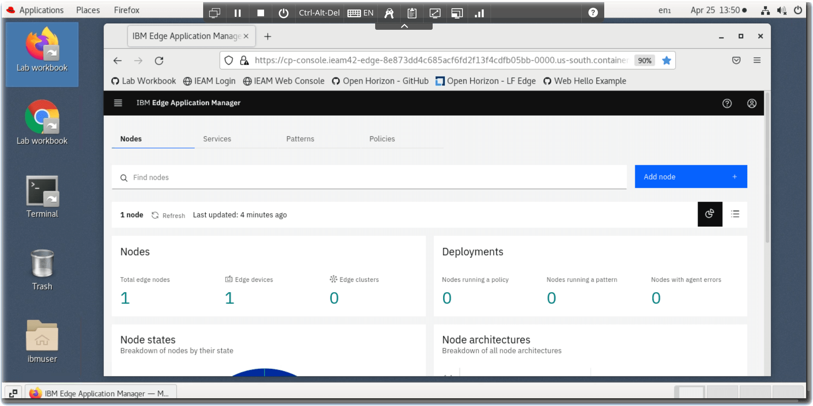
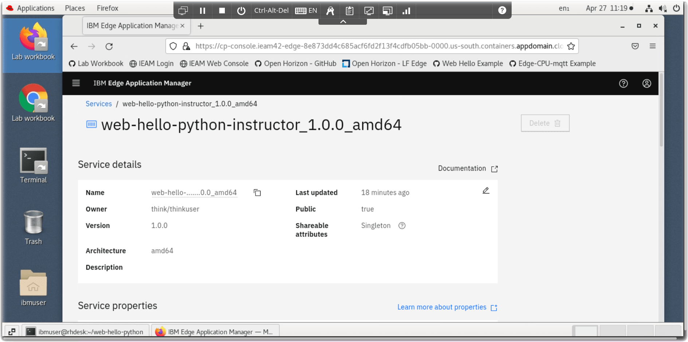
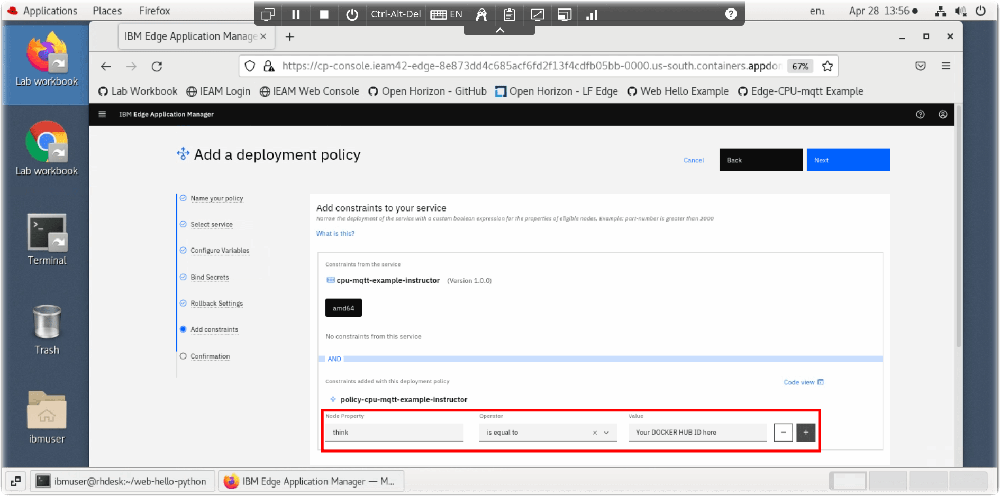

# Introduction to IBM Edge Application Manager - IEAM

Introduction to IBM Edge Application Manager - Think Academy Online 2022 Lab #1133 lab guide workbook

Successfully deploy models to the edge using IBM Edge Application Manager workload orchestration

## Introduction

Gain hands-on experience with the IBM Edge Application Manager web management console. Install the Horizon agent, then deploy and manage a Horizon edge service on your edge device.

This Think Academy lab session is available for [IBM Think Academy Online 2022](https://www.ibm.com/events/event/pages/ibm/u1b2gvmb/1581037797007001pjad.html) attendees (Virtual Sign up for Free!)

## Prerequistes

- Create a free [IBM Cloud account](https://cloud.ibm.com/registration)
- Register for the [IBM Think Academy Online 2022](https://www.ibm.com/events/event/widget/ibm/u1b2gvmb/ibm-catalog?search=1133) lab session #1133

## Lab Objectives

- Access the IBM Edge Application Manager Lab virtual machine environment
- Learn about IEAM components
- Explore the IEAM web console
- Register an Edge node
- Experiment with the hzn command line interface
- Configure IEAM Services and Policies
- Deploy containerized workloads to your edge device

<div style="page-break-after: always"></div>

## Access to the Think Academy Online 2022 Lab Environment

- Select **ibmuser**
  

- Login Credentials for the virtual machine are stored in the toolbar
- Click on the **Keys** icon in the top toolbar
  

- A drop down dialog will appear with various credentials used in this lab
- Click on the **Insert** button for the ibmuser password
- Click on the **Sign In** button

<div style="page-break-after: always"></div>

### Navigating the Virtual Machine

This lab will use several components within the RHEL Gnome desktop environment:

- Review the desktop
  

  - a terminal window to execute `hzn` Horizon edge agent commands
  - a browser window with access to the IBM Edge Application Manager web console
  - this GitHub repository / PDF which provides exercises to learn about IEAM, the Horizon agent, and containerized edge workloads
  - a **Lab workbook** Firefox or Chrome icon link
  - the browser will open to the [Introduction to IBM Edge Application Manager - IEAM](https://github.com/IBM/Introduction-to-IEAM) github repo
  - additional browser Bookmark bar resources

### IEAM Component Definitions

Before proceeding to the lab instructions, let's review some IEAM component definitions.

- *IEAM Management Hub* - The web UI used by IEAM administrators to view and manage the other components of IBM Edge Application Manager.
- *Node* - Typically, **edge devices** have a prescriptive purpose, provide (often limited) compute capabilities, and are located near or at the data source. Currently [supported IEAM edge device OS and architectures](https://www.ibm.com/docs/en/edge-computing/4.3?topic=devices-preparing-edge-device#suparch-horizon):
  - x86_64
    - Linux x86_64 devices or virtual machines that run Ubuntu 20.x (focal), Ubuntu 18.x (bionic), Debian 10 (buster), Debian 9 (stretch)
    - Red Hat Enterprise Linux® 8.1, 8.2, and 8.3
    - Fedora Workstation 32
    - CentOS 8.1, 8.2, and 8.3
    - SuSE 15 SP2
  - ppc64le
    - Linux ppc64le devices or virtual machines that run Ubuntu 20.x (focal) or Ubuntu 18.x (bionic)
    - Red Hat Enterprise Linux® 7.6, 7.9, 8.1, 8.2, and 8.3
  - ARM (32-bit)
    - Linux on ARM (32-bit), for example Raspberry Pi, running Raspberry Pi OS buster or stretch
  - ARM (64-bit)
    - Linux on ARM (64-bit), for example NVIDIA Jetson Nano, TX1, or TX2, running Ubuntu 18.x (bionic)
  - Mac
    - macOS
- *Containerized Workload* - Any Docker/OCI containerized service, microservice, or piece of software that does meaningful work when it runs on an edge node.
- *Service* - A service that is designed specifically to be deployed on an edge cluster, edge gateway, or edge device. Visual recognition, acoustic insights, and speech recognition are all examples of potential edge services.
- *properties* - name/value pairs, often used to describe attributes of nodes (like model, serial number, role, capabilities, attached hardware. etc.) or attributes of a service or deployment (see "policy").
- *constraints* - logical expressions in terms of "properties". Constraints are used to control and manage software deployment to edge nodes.
- *policy* - a collection of zero or more properties and zero or more constraints, sometimes with additional data fields (see "node policy", "service policy", and "deployment policy"
- *node policy* - a set of properties and constraints related to an edge node (either a stand-alone Linux edge node or a Kubernetes cluster node)
- *service policy* - a set of properties and constraints related to a specific deployable service
- *business policy* - (deprecated) the former name for "deployment policy"
- *deployment policy* - a set of properties and constraints related to the deployment of a specific service together with an identifier for the service version to deploy, and other information such as how rollbacks should be handled when failures occur.
- *pattern* - another name for "deployment pattern"
- *deployment pattern* - a list of specific deployable services. Patterns are a simplification of the more general, and more capable, "policy" mechanism. Edge nodes can register with a deployment pattern to cause the pattern's set of services to be deployed.
- *IEAM Edge Cluster* - IBM Edge Application Manager (IEAM) [edge cluster capability](https://www.ibm.com/docs/en/edge-computing/4.3?topic=nodes-edge-clusters) helps you manage and deploy workloads from a management hub cluster to remote instances of OpenShift® Container Platform or other Kubernetes-based clusters. Edge clusters are IEAM edge nodes that are Kubernetes clusters. An edge cluster enables use cases at the edge, which require colocation of compute with business operations, or that require more scalability, availability, and compute capability than what can be supported by an edge device.  IEAM edge cluster configuration is outside the scope of this introduction lab.

<div style="page-break-after: always"></div>

## Architecture

The goal of edge computing is to harness the disciplines that have been created for hybrid cloud computing to support remote operations of edge computing facilities. IEAM is designed for that purpose.

The deployment of IEAM includes the management hub that runs in an instance of OpenShift Container Platform installed in your data center. The management hub is where the management of all of your remote edge nodes (edge devices and edge clusters) occurs.

These edge nodes can be installed in remote on-premises locations to make your application workloads local to where your critical business operations physically occur, such as at your factories, warehouses, retail outlets, distribution centers, and more.

The following diagram depicts the high-level topology for a typical edge computing setup:


<div style="page-break-after: always"></div>

## Let's Get Started

### Explore the IEAM web console

In this section, explore the IEAM mgmt web console.

- Click either the Firefox or Chrome browser icon on your desktop
  - **Note:** Launch IBM Edge Application Manager by selecting **IEAM Login** from the browser toolbar.
  - You may also need to click on the Advanced button and proceed to the self-signed certificate.
  - Choose **Default Authenication**.
- Login into the IEAM console
  
- The `thinkuser` userid / password are already saved in your browser keystore but if you need to, use the **Keys** toolbar to insert the password.

- **Note:** If you receive a `403` error, modify the browser URL in the address bar, remove the `common-nav/403` and replace it with `edge`.  Or click on the `IEAM Web Console` link in the browser Bookmark bar.
- Nodes
  - Manage the node properties and constraints
  - **Note:** there are only a few edge nodes registered. In a subsequent section of the lab, your edge node will appear here.
  
- Services
  
- Patterns
  
- Policies
  

<div style="page-break-after: always"></div>

### Explore the "Edge" Device

The virtual machine lab environment provided during the Think 2022 lab will be your "edge device" today. Normally, your edge device might be an industrial computer, small board computer, etc.

- Click on the **Terminal** icon and launch a console window.
  

- To simplify the edge lab setup, the HZN environment variables have been pre-configured in the ~/.bashrc profile

- Inspect the HZN environment variables by entering this shell pipeline

  ```sh
  export | grep HZN
  ```

   **Note:** (the urls and iamapikey have been blurred in the public screenshots)

<div style="page-break-after: always"></div>

- Set your HZN_NODE_ID environment variable to something unique which will allow you to find your "edge" device in the IEAM management console.  eg `think-edge-<yourname>`

   ```sh
   export HZN_NODE_ID=think-edge-<yourname>
   ```

   

- **Stop** : Did you `export HZN_NODE_ID=think-edge-<yourname>` as required in the above step?  You won't be able to find your device in the IEAM mgmt console if you don't set a node name.

<div style="page-break-after: always"></div>

### Install / Register your edge node

- Enter the following command in the Terminal window to install and register the agent into the IEAM management hub.

  ```sh
  sudo -s -E ./agent-install.sh -i 'css:' -p IBM/pattern-ibm.helloworld -w '*' -T 120
  ```

  
  Use the **Keys** toolbar to insert the `ibmuser` password at the `sudo` prompt

- When the node registration completes, it will have also configured an `IBM/pattern-ibm.helloworld` pattern to execute on this node.
  

- Query the Horizon agent version that was installed

```sh
hzn version
Horizon CLI version: 2.29.0-595
Horizon Agent version: 2.29.0-595
```

- Return to the IEAM web console.  Switch to the `Nodes` section, Click on the `Refresh` button and find your device.

  

  - **Warning:** If you don't see your node, or you skipped the step which sets the name of your edge node, `export HZN_NODE_ID=think-edge-<yourname>` , you can unregister the node and try again.

    ```sh
    sudo hzn unregister -vrfD
    export HZN_NODE_ID=think-edge-<yourname>
    sudo -s -E ./agent-install.sh -i 'css:' -p IBM/pattern-ibm.helloworld -w '*' -T 120
    ```

- Return to the Terminal window. See what agreements are running.

  ```sh
  watch hzn agreement list
  ```

  

- Query details about your node

  ```sh
  hzn node list
  ```

  

<div style="page-break-after: always"></div>

### Using the Horizon HZN command line

There are many horizon command line interface parameters.  This section will explore some of them.

```sh
hzn help
```

The IEAM management hub installation includes several examples which have been published into the exchange automatically. These services, patterns and policies can target different CPU architectures and constraints. IEAM also supports rollback between service containers.  The following commands will list the services, patterns, and deployment policies available in your exchange:

**Note:** The following commands assume you have the Horizon environment variables `HZN_ORG_ID` and `HZN_EXCHANGE_USER_AUTH` set

```sh
hzn exchange service list IBM/
```


<div style="page-break-after: always"></div>

```sh
hzn exchange pattern list IBM/
```


```sh
hzn exchange deployment listpolicy
```


<div style="page-break-after: always"></div>

- Review the event log for this node.

```sh
hzn eventlog list
```


<div style="page-break-after: always"></div>

## Web Hello containerized workload

In this exercise, we will create a Web Hello service that runs a containerized HTTP server workload on your edge device.  The [web-hello-python](https://github.com/TheMosquito/web-hello-python) example is an extremely simple HTTP server (written in Python) that responds on port 8000 with a hello message.

The core principle of IBM Edge Application Manager is to orchestrate containizered workloads, at scale, on edge devices.  Edge developers should be familiar with creating Docker containers optimized for (CPU/Memory/Power) constrained devices.  This example builds a small container, pushes it to your Docker Hub registry and creates a service and pattern in the IEAM exchange hub.

The source / instructions to build the container are posted in the [web-hello-python](https://github.com/TheMosquito/web-hello-python) github repository, but are copied here for the lab exercise.

- Open a Terminal window in your virtual machine
- Clone the github repository:

  ```sh
  cd
  git clone https://github.com/TheMosquito/web-hello-python
  cd web-hello-python
  ```

- Log into your Docker Hub account so the container can be hosted for edge deployment

  ```sh
  docker login
  ```

- Edit the variables at the top of the Makefile as desired. If you plan to push it to a Docker registry, make sure you give your docker ID. You may also want to create unique names for your service and pattern (necessary for this lab in the multi-tenant IEAM instance that is shared with other lab participants and you are all publishing this service).
  - gedit / vi / nano editors are available
  - Change the following `Makefile` lines:

    ```make
    DOCKERHUB_ID:=<your docker registry account>
    SERVICE_NAME:="web-hello-python-<yourname>"
    SERVICE_VERSION:="1.0.0"
    PATTERN_NAME:="pattern-web-hello-python-<yourname>"
    ```

- Create a hzn cryptographic signing keys. All edge services and deployment patterns must be cryptographically signed. If you do not already have an appropriate asymmetric cryptographic signing key pair, you must create a key pair that you can use for signing. If you need to create a new key pair, run the following command:

  ```sh
  hzn key create **yourcompany** **youremail**
  ```

  This command creates the following two files:

    ```sh
    ~/.hzn/keys/service.private.key
    ~/.hzn/keys/service.public.pem
    ```

- Build the container, push the container to the Docker registry, publish the service and publish the pattern

  ```sh
  make build
  make push
  make publish-service
  make publish-pattern
  ```

- Before we can register this containerized workload to run on your specific Horizon edge node, you will need to unregister the prior IEAM pattern. Remember, only one deployment pattern can be registered on an edge node.

  ```sh
  hzn unregister -v
  make agent-run
  watch hzn agreement list
  ```

  

<div style="page-break-after: always"></div>

- Test your web-hello containerized workload

  ```sh
  make test
  ```

- Test your containerize workload by opening a browser session to http://localhost:8000

- Test the container on the command line

  ```sh
  curl -sS http://localhost:8000

  <!DOCTYPE html>

  <html>
  <head>

  <meta charset="utf-8">

  <title>WebHello</title>

  </head>
  <body>
  Hello, "172.17.0.1".
  </body>
  </html>
  ```

  

- In this section, you will return to the IEAM web console to  confirm the creation of the Web Hello service and pattern.

  - Open the IEAM Web Console in the browser in the virtual machine. Find the link to the IEAM Web Console in the Bookmark bar.
  - Navigate to the **Services** tab
    
  - Click on the **web-hello-python-\<yourname\>_1.0.0_amd64** in the Services list
    
  - Scroll down to the **Deployment** section and click the **pattern-web-hello-python-\<yourname\>**
    
  - The **pattern-web-hello-python-\<yourname\>** Pattern page will open.
    
  - Click on the Trash button and **Yes, delete pattern** confirmation button to delete your pattern.  Once deleted, the agreemment will be cancelled and workload in your VM will stop.
    

<div style="page-break-after: always"></div>

## CPU Details to MQTT containerized workload

In this exercise, we will create a Docker containerized workload that can be deployed to an edge node running the Open Horizon agent. The workload can be configured as a managed service and deployment policy in IBM Edge Application Manager. It collects CPU details periodically and sends the results over MQTT to Watson IoT Platform and plots the results in a cloud hosted dashboard. This example builds a small container, pushes it to your Docker Hub registry and creates a service and policy in the IEAM exchange mgmt hub.

The source / instructions to build the container are posted in the [openhorizon-edge-cpu-mqtt](https://github.com/johnwalicki/openhorizon-edge-cpu-mqtt) github repository, but are copied here for the lab exercise.

- Open a Terminal window in your virtual machine
- Clone the github repository:

  ```sh
  cd
  git clone https://github.com/johnwalicki/openhorizon-edge-cpu-mqtt
  cd openhorizon-edge-cpu-mqtt
  ```

- Log into your Docker Hub account so the container can be hosted for edge deployment

  ```sh
  docker login
  ```

- Edit the variables at the top of the Makefile as desired. If you plan to push it to a Docker registry, make sure you give your docker ID. You may also want to create unique names for your service and policy (necessary for this lab in the multi-tenant IEAM instance that is shared with other lab participants and you are all publishing this service).
  - gedit / vi / nano editors are available
  - Change the following `Makefile` lines:

    ```make
    DOCKERHUB_ID:=<your docker registry account>
    SERVICE_NAME:="cpu-mqtt-example-<yourname>"
    SERVICE_VERSION:="1.0.0"
    ```

- The prior section created hzn cryptographic signing keys. If you need to create a new key pair, run the following command:

  ```sh
  hzn key create **yourcompany** **youremail**
  ```

  This command creates the following two files:

    ```sh
    ~/.hzn/keys/service.private.key
    ~/.hzn/keys/service.public.pem
    ```

- Build the container, push the container to the Docker registry and publish the service.

  ```sh
  make build
  make push
  make publish-service
  ```

- Instead of publishing the policy from the `hzn` command line interface using and `make publish-policy`, in this exercise, open the IEAM web console browser page again from the bookmark bar.

  - Select the **Services** tab. If you sort the services in table format, you will see the **cpu-mqtt-example-\<yourname\>** service that was just published from the **hzn** CLI.
    
  - Select your new service.
    
  - Scroll down to the **Service variables** section. You will notice that the `make publish-service` command created a service with four MQTT variables. One of the variables does not have a default value.  You could have used the IEAM Add Service panels to create all of these variables interactively. To avoid mistyping environment variables required by the scripts inside the container, the `service.json` file created them for you.  In the last section of this workshop, you will set the missing variable via a deployment policy.
    

- Now that the Service is defined, add a Policy
  - Select the **Policies** tab and click on the **Add policy** button.
    
  - Give your policy a name, eg `policy-cpu-mqtt-example-<yourname>` and click the **Next** button.
    
  - Search / Find the `cpu-mqtt-example-<yourname>` service, press the **Add +** button and the **Next** button.
    

<div style="page-break-after: always"></div>

  - On the **Configure Variables** panel, enter the **MQTT_ORGID** that will be dynamically added to the Service container. (For security reasons, the instructor did not want to add all the environment variables credentials to the service.json file hosted on GitHub).

    The correct value of the MQTT_ORGID is:

    ```text
    5YRUSP
    ```

    

  - Press the **Next** button to skip setting secrets for the policy
  - Press the **Next** button to skip setting rollback rules for the policy
  - Define constraints where this policy will be valid. Enter `think`, Enter `is equal to`, Enter `<your DockerHub ID>`
    
  - Press the **Publish policy** button on the confirmation panel
    

- Before we can register this containerized workload to run on your specific Horizon edge node, you will need to unregister the prior IEAM pattern. You might have deleted it from the IEAM web console at the end of the prior section. Remember, only one deployment pattern can be registered on an edge node.

  ```sh
  hzn unregister -v
  make agent-run
  watch hzn agreement list
  ```

- Observe the CPU data measured by your containerize workload by viewing the instructor's [CPU Metrics Dashboard](https://node-red-cpu-edge-telemetry.b113cqgixda.us-south.codeengine.appdomain.cloud/ui)

  

<div style="page-break-after: always"></div>

## Congratulations !

You have completed the **Think 2022 Introduction to IEAM lab**. There are additional resources below. Continue your IEAM / Open Horizon learning journey by watching the [Open Horizon YouTube video playlist](https://www.youtube.com/playlist?list=PLgohd895XSUddtseFy4HxCqTqqlYfW8Ix).

If you enjoyed the session, give the [Introduction to IEAM](http://github.com/IBM/Introduction-to-IEAM) repository a GitHub star and connect with the [instructors](http://twitter.com/johnwalicki).

Clean up your session before exiting the Virtual Machine by deleting your Docker credentials and unregistering your Horizon edge device.

```sh
rm -rf ~/.docker

hzn unregister
```

## Additional Resources

- https://www.lfedge.org/projects/openhorizon/
- https://github.com/open-horizon/
- https://www.ibm.com/docs/en/edge-computing/4.3
- https://www.ibm.com/docs/en/edge-computing/4.3?topic=agent-automated-installation-registration
- https://github.com/open-horizon/examples
- https://developer.ibm.com/videos/introduction-to-ibm-edge-application-manager/
- https://developer.ibm.com/articles/what-is-edge-computing/

### Author

- [John Walicki](https://github.com/johnwalicki/)

___

Enjoy!  Give me [feedback](https://github.com/IBM/Introduction-to-IEAM/issues) if you have suggestions on how to improve this lab workbook.

## License

This lab workbook is licensed under the Apache Software License, Version 2.  Separate third party code objects invoked within this lab are licensed by their respective providers pursuant to their own separate licenses. Contributions are subject to the [Developer Certificate of Origin, Version 1.1 (DCO)](https://developercertificate.org/) and the [Apache Software License, Version 2](http://www.apache.org/licenses/LICENSE-2.0.txt).

[Apache Software License (ASL) FAQ](http://www.apache.org/foundation/license-faq.html#WhatDoesItMEAN)
